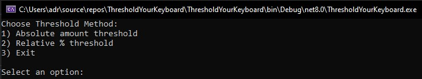
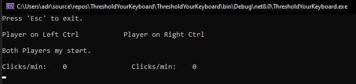
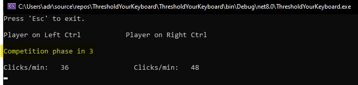
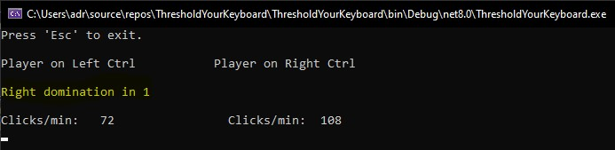
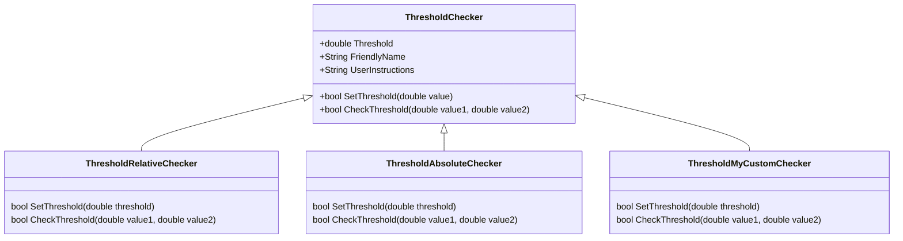
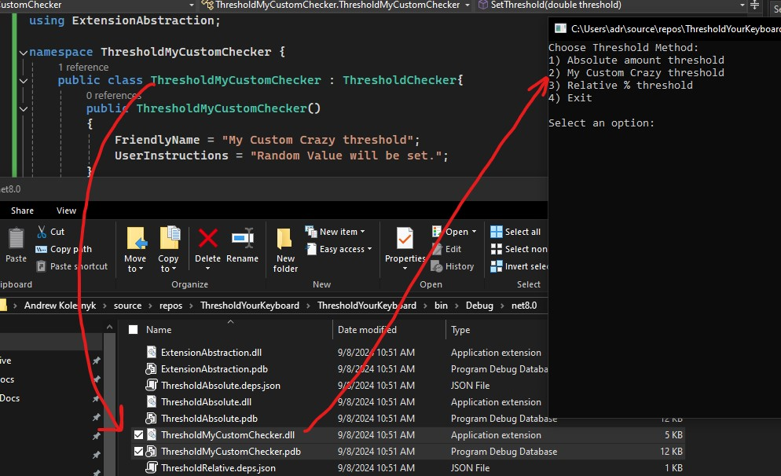

<h1 align="center">
	Threshold Your Keyboard
</h1>

 Is a unicorn startup :rocket: from Bayonne, NJ. A grate way to spend Friday evening with :beers: and :wrestling:.
Two players must click `Ctrl` button on :keyboard:. `Left Ctrl` and `Right Ctrl` respectively.
Wins the one who makes more clicks per/min.
To win, player must sustain its supremacy for 5 sec. Complexity can by adjusted by changing threshold size and method of threshold calculation.
> Warning:
This project serve as proof-of-concept to validate the feasibility of scaling out and potentially monetizing the game. Before going to IPO, need to check with attorney if we can by liable for any broken keyboards.

## Local setup

- [Clone the repo](https://github.com/swabber/ThresholdYourKeyboard) to your local drive with `git clone https://github.com/swabber/ThresholdYourKeyboard`
- Open `ThresholdYourKeyboard.sln` in [Visual Studio](https://visualstudio.microsoft.com/)
- Ensure projects located in [Plugins](./Plugins/) folder have option `..\..\ThresholdYourKeyboard\bin\` set in `Properties` -> `Build` -> `Output` -> `Base output path`
- Run the games with the `Debug`->`Start Debugging` (default hotkey `F5`) option in the menu strip.
  
- 1st and 2nd Threshold methods are default, pre-build functionality which you are welcome to [extend](#get-involved). They are loaded dynamically on game start.
- choose Threshold method and set value. This would lead you into man screen.
  
- Game will give 5 sec for players to rump up to speed after both players do their first click on `Ctrl` button.
  
- After threshold breached, winning player have to sustain its supremacy for 5 sec. to win.
  

## Get Involved.
You are welcome to write your own custom threshold calculation rules by inheriting from [ThresholdChecker.cs](./Plugins/ExtensionAbstraction/ThresholdChecker.cs) located in `ExtensionAbstraction.dll` and dropping your .dll into root folder of the game.
Implementation of abstract `ThresholdChecker` class would force you to implement constructor with no arguments. It is needed to smoothly instantiate class dynamical.

